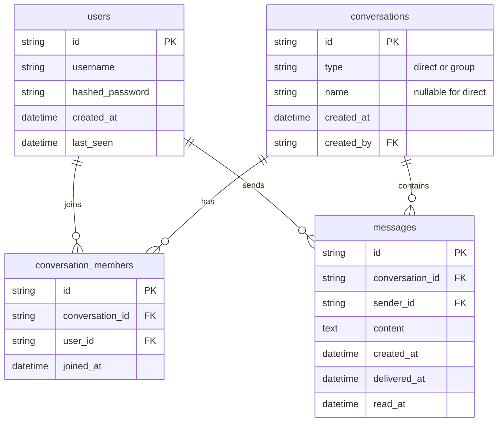

# Private Chat — Modern Messaging Application

A clean, modern, and lightweight messaging web application supporting **1-to-1 Direct Chats** and **Group Chats** with real-time WebSocket communication, persistent database storage, and a polished dark UI.

---

## 1. Features

- **Authentication**:
  - Simple, secure username/password registration and login.
  - JWT authentication stored securely in **HttpOnly, SameSite=Lax** cookies.
  - No user count limits — users can register normally.
- **1-to-1 Direct Chats**:
  - Search and select any registered user from the directory.
  - Start an isolated 1-to-1 conversation.
  - Dynamic display name matching your partner's username.
  - Real-time online/offline presence indicator and last-seen timestamps.
- **Group Chats**:
  - Create groups with a custom title/subject.
  - Select and add multiple participants.
  - Add additional members to existing groups at any time.
  - Real-time group messaging: all group members receive messages instantaneously.
  - Sender names displayed on received group message bubbles.
- **Real-Time WebSockets**:
  - Bidirectional communication routed dynamically by `conversation_id`.
  - Delivery and read receipts (`✓` Sent, `✓✓` Delivered, `✓✓` Read in cyan `#53bdeb`).
  - Real-time typing indicators for direct and group chats.
  - Automatic reconnection with exponential backoff on network drops.
- **Authorization Guard**:
  - Strict membership verification: users can only view or participate in conversations they belong to. Non-members are rejected with `HTTP 403 Forbidden`.
- **Persistent Database**:
  - Messages and conversations persist across browser reloads.
  - SQLite for local zero-dependency development (`private_chat.db`).
  - Production-ready for PostgreSQL (Neon, Supabase, Render, Railway).
- **Clean UI**:
  - Premium modern dark aesthetic (`#0c1317`, `#111b21`, `#202c33`, `#00a884`).
  - Sidebar showing active conversations, unread badges, last message previews, and quick actions (`+ New Chat`, `+ New Group`).
  - Enter to send, Shift+Enter for newlines, auto-scrolling to latest message, and date dividers.

---

## 2. Tech Stack

- **Frontend**: Next.js (App Router), React, Tailwind CSS, Lucide Icons, WebSocket Client, Fetch API (with credentials forwarding).
- **Backend**: Python 3.12+, FastAPI, Uvicorn, SQLAlchemy 2.0 ORM, PyJWT, Bcrypt, WebSockets.
- **Database**: SQLite (Local Dev) / PostgreSQL (Production).

---

## 3. Database Schema



---

## 4. Local Development Setup

### Backend
1. Open a terminal in `backend/`:
   ```bash
   cd backend
   .\.venv\Scripts\activate
   pip install -r requirements.txt
   ```
2. Run automated tests:
   ```bash
   pytest -v
   ```
3. Start the backend:
   ```bash
   python -m uvicorn app.main:app --host 127.0.0.1 --port 8000 --reload
   ```

### Frontend
1. Open a terminal in `frontend/`:
   ```bash
   cd frontend
   npm install
   npm run dev
   ```
2. Open your browser to [http://localhost:3000](http://localhost:3000).

---

## 5. API Endpoints

### Auth & Users
- `POST /api/auth/register`: Create user account
- `POST /api/auth/login`: Authenticate and set HttpOnly cookie
- `POST /api/auth/logout`: Clear session cookie
- `GET /api/auth/me`: Get current user profile
- `GET /api/users`: Get list of registered users (excluding self)
- `GET /api/users/search?q=...`: Search users by username

### Conversations & Messages
- `GET /api/conversations`: List user's direct and group conversations
- `POST /api/conversations/direct`: Start or get 1-to-1 conversation with a user
- `POST /api/conversations/group`: Create a new group chat with members
- `GET /api/conversations/{id}`: Get conversation details & members
- `POST /api/conversations/{id}/members`: Add members to group
- `GET /api/conversations/{id}/messages`: Fetch chronological message history
- `POST /api/conversations/{id}/messages`: Send a message (REST fallback)
- `POST /api/conversations/{id}/read`: Mark unread messages in conversation as read

### WebSockets
- `WS /ws/chat`: Real-time bidirectional connection for messaging, read receipts, typing, and presence.

---

## 6. Testing

The backend includes a comprehensive pytest suite:
```bash
cd backend
pytest -v
```

### Verified Test Cases:
1. `test_registration_and_multi_user_support`: Normal multi-user registration without restrictions.
2. `test_duplicate_username_rejection`: Validates duplicate username rejection.
3. `test_login_and_logout`: Tests credential validation, cookie issuance, and logout clearing.
4. `test_users_list_and_search`: Verifies user directory and substring search.
5. `test_direct_and_group_conversations`: Tests direct chat creation, group creation, member addition, and message exchange.
6. `test_empty_and_long_messages`: Enforces non-empty message requirement and 4000 character length cap.
7. `test_websocket_unauthorized_rejection`: Validates unauthenticated WebSocket connection closure.
8. `test_websocket_group_broadcast_and_receipts`: Verifies real-time group message broadcasting across all active members.
9. `test_websocket_non_member_cannot_send_to_conversation`: Validates security guard preventing non-members from messaging private chats.

---

## 7. Production Deployment Guide

### Option A: Docker Compose (All-in-One)
The repository includes production Dockerfiles and a `docker-compose.yml` orchestrating PostgreSQL, FastAPI, and Next.js.

1. **Configure Environment Variables**:
   Copy `.env.example` to `.env` and set secure credentials:
   ```bash
   JWT_SECRET=$(openssl rand -hex 32)
   POSTGRES_PASSWORD=your_strong_db_password
   ```

2. **Build and Run**:
   ```bash
   docker compose up -d --build
   ```

3. **Access Services**:
   - **Frontend UI**: [http://localhost:3000](http://localhost:3000)
   - **Backend API**: [http://localhost:8000](http://localhost:8000)
   - **API Docs**: [http://localhost:8000/docs](http://localhost:8000/docs)
   - **Health Check**: [http://localhost:8000/api/health](http://localhost:8000/api/health)

---

### Option B: Render Blueprint (One-Click Cloud)
This repository includes a `render.yaml` blueprint:

1. Push your repository to GitHub.
2. In [Render Dashboard](https://dashboard.render.com), click **New +** -> **Blueprint**.
3. Select this repository. Render will automatically provision:
   - **privatechat-db**: Managed PostgreSQL instance.
   - **privatechat-backend**: FastAPI web service with environment variables pre-linked.
   - **privatechat-frontend**: Next.js web service linked to the backend API.

---

### Option C: Vercel (Frontend) + Railway / Render (Backend)
1. **Backend Deployment**:
   - Create a PostgreSQL database on [Railway](https://railway.app) or [Render](https://render.com).
   - Set the Root Directory to `backend`.
   - Set the Start Command: `uvicorn app.main:app --host 0.0.0.0 --port $PORT`
   - Set Environment Variables:
     - `DATABASE_URL`: Your PostgreSQL connection string.
     - `JWT_SECRET`: Random 32+ character string.
     - `COOKIE_SECURE`: `true`
     - `COOKIE_SAMESITE`: `none`
     - `CORS_ORIGINS`: Your Vercel domain (e.g., `https://your-chat.vercel.app`).
2. **Frontend Deployment**:
   - Import the repository on [Vercel](https://vercel.com).
   - Set the Root Directory to `frontend`.
   - Set Environment Variable:
     - `NEXT_PUBLIC_API_URL`: `https://your-backend.up.railway.app`
     - (Note: `NEXT_PUBLIC_WS_URL` will automatically infer `wss://.../ws/chat`).

